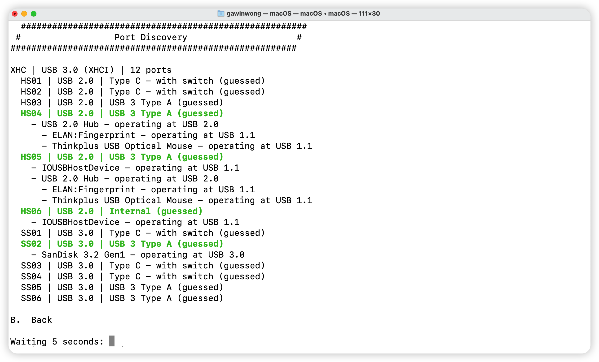
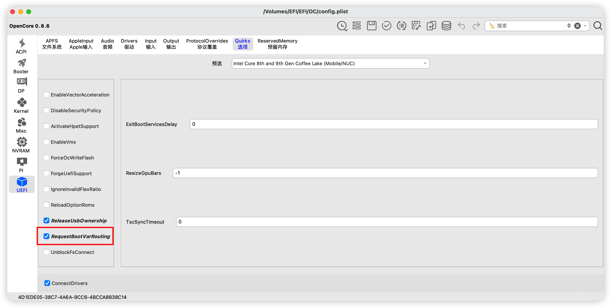
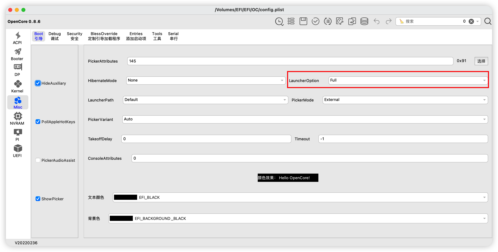

# macOS 简明安装教程

### 0. 详细安装参考[Opencore安装指南][1]

### 1. 准备镜像
可以通过远景论坛、其他黑苹果社区获取，最好使用原版镜像

### 2. 制作启动U盘
使用[etcher][2]，准备一个32G以上的U盘

### 3. 定制USB驱动
使用[USBToolBox][10]，启动后按`D`开始整理USB端口信息

每个USB口都使用USB2.0 USB3.0设备插5、6s。如果是TypeC口，就翻面各插5、6s 
所有USB口都插过后，按`B`返回上一级，按`S`开始制作驱动，再按`K`制作驱动，生成UTBMap.kext，同时下载[USBToolBox.kext][11]以备后用

### 4. 定制EFI
- 下载[OCAT][3]，首先更新opencore到最新版

- 根据电脑配置预生成一个EFI样例

- 根据opencore安装指南，调整EFI文件夹内容
    - **ACPI** 
    只需要[基础的几个][4]，可以使用预编译好的aml文件。 
    **`可以把文件直接从文件夹拖到OCAT里，会自动更新config.plist并把文件复制到EFI对应位置`**
    

    - **Drivers** 
    可以只用[基础的几个][5]，需要引导Linux、使用其他功能则按需添加
    

    - **Kexts** 
    可以只用[基础的几个][6]，暂时不管声卡、无线网卡、蓝牙，放入先前准备好的UTBMap.kext和USBToolBox.kext 
    **`Kexts的顺序很重要，前三个最好是Lilu、VirtualSMC、WhateverGreen，可以使用右下角箭头按钮调整kext的顺序`**
    

    - **Resources** 
    可以先用默认的

    - **Tools** 
    图里的这几个用于解锁CFG LOCK，暂时可以先不解锁，[modGRUBShell.efi][7]需要单独下载
    

    - **config.plist** 
    根据opencore指南，选择电脑对应的[config参考][8] 
    上面准备文件的过程已经完成了大部分config配置，还有一些Quirks需要注意 
    除了根据指南自己配，也可以使用OCAT提供的一些默认配置，斜体选项就是推荐的设置
    
    
    
    如果没有解锁CFG LOCK，需要先把AppleXcpmCfgLock勾上，macOS 11.3+的系统不需要勾选XhciPortLimit
    

    - **机型设置** 
    使用OCAT自带的三码生成工具，选择与电脑最接近的CPU型号
    
    生成后需要查询序列号是否有效，必须是无效的码才行，不然会和白果冲突，点击`检查`即可跳转，下图这样才是能用的码
    

    - **AAPL,ig-platform-id** 
    安装时需要使用12345678，等安装结束再进一步修改
    

    - **boot-args** 
    可以打开-v选项，以便在boot失败时看到报错信息
    
    
- 使用DiskGenius或者其他方法挂载EFI分区，将整理好的EFI文件夹拖放到U盘的EFI分区根目录

### 5. 磁盘准备
建议还是单独准备一块SSD硬盘用于安装macOS，这个教程只讨论单独一块硬盘安装macOS的情况

### 6. 修改BIOS设置
参考指南，[对BIOS进行调整][9]，必须要注意的几个点：磁盘设置为AHCI、关闭Fast Boot、关闭Secure Boot，还要清除Secure Boot的所有默认设置(尤其这个害我一直没驱动核显)。后期如果有什么疑难问题，EFI没有出现预期的结果，多半是BIOS的设置有问题

### 7. 正式安装
1）进入BIOS，选择U盘启动

2）进入OC引导界面，选择`CleanNvram.efi`，先把Nvram清除一下，如果看不到`CleanNvram.efi`，就按一下空格。出现成功的提示后会回到OC引导界面，按下`Ctrl+Alt+Delete`重启，再次选择U盘启动，点击`Install xxxxxx`

3）耐心等待直到出现画面，如果过了10分钟还是停留在输出启动日志的状态或者卡住不动了那就是boot失败，需要再检查下EFI和BIOS，同时参考网上成功的例子，看看是否需要额外特殊的配置

如果有跟我一样看到`Failed to bootstrap SB NVRAM values. Invalid Parameter`，需要在Nvram Add里加一条，`4D1EDE05-38C7-4A6A-9CC6-4BCCA8B38C14:BridgeOSHardwareModel`

4）进入安装界面，选择`磁盘工具(Disk Utility)`，选中准备好的磁盘，点击`抹掉(erase)`，抹成`APFS`格式，并取个名字，完成后退出磁盘工具，选择`Install xxxxxx`

5）一直点下一步或同意，选择刚才抹好的磁盘继续

6）之后会重启几次，每次都需要选择U盘启动，然后点击`macOS installer`那个选项而不是`Install xxxxxx`，之后开始耐心等待

7）等再次重启看到没有`macOS installer`选项了，就可以点击第4步取的名字的那个引导

8）进入系统后，暂时比较卡，因为没有驱动核显，这时初始安装就结束了

### 8. 完善EFI
- [解锁CFG LOCK及更改DVMT](../Docs/%E8%A7%A3%E9%94%81CFG%20LOCK%E5%8F%8A%E6%9B%B4%E6%94%B9DVMT.md)
- [驱动核显](../Docs/%E9%A9%B1%E5%8A%A8%E6%A0%B8%E6%98%BE.md)
- [驱动声卡](../Docs/%E9%A9%B1%E5%8A%A8%E5%A3%B0%E5%8D%A1.md)
- [驱动无线网卡](../Docs/%E9%A9%B1%E5%8A%A8%E6%97%A0%E7%BA%BF%E7%BD%91%E5%8D%A1.md)
- [驱动蓝牙](../Docs/%E9%A9%B1%E5%8A%A8%E8%93%9D%E7%89%99.md)

### 9. 引导多系统
主要参考[这篇教程][12]
- 如果是多个硬盘，只在macOS所在硬盘的EFI分区保留OC引导文件夹
- Windows可以直接识别
- Linux需要添加`OpenLinuxBoot.efi`和`ext4_x64.efi`到drivers目录，同时确保config.plist的以下两项已被正确设置，重启后会在OC同级目录生成linux的引导目录，可选地删除原先其他硬盘EFI里的linux Grub引导

### 10. 其他功能完善
- OLED屏幕没法通过驱动或者补丁调节亮度，使用第三方软件[MonitorControl Lite][13]来调节亮度

[1]: https://dortania.github.io/OpenCore-Install-Guide/
[2]: https://github.com/balena-io/etcher/releases
[3]: https://github.com/ic005k/OCAuxiliaryTools/releases
[4]: https://dortania.github.io/OpenCore-Install-Guide/ktext.html#laptop
[5]: https://dortania.github.io/OpenCore-Install-Guide/ktext.html#firmware-drivers
[6]: https://dortania.github.io/OpenCore-Install-Guide/ktext.html#kexts
[7]: https://github.com/datasone/grub-mod-setup_var/releases
[8]: https://dortania.github.io/OpenCore-Install-Guide/config.plist/#selecting-your-platform
[9]: https://dortania.github.io/OpenCore-Install-Guide/config-laptop.plist/coffee-lake.html#intel-bios-settings
[10]: https://github.com/USBToolBox/tool/releases
[11]: https://github.com/USBToolBox/kext/releases
[12]: https://dortania.github.io/OpenCore-Multiboot/
[13]: https://apps.apple.com/us/app/monitorcontrol-lite/id1595464182?mt=12
