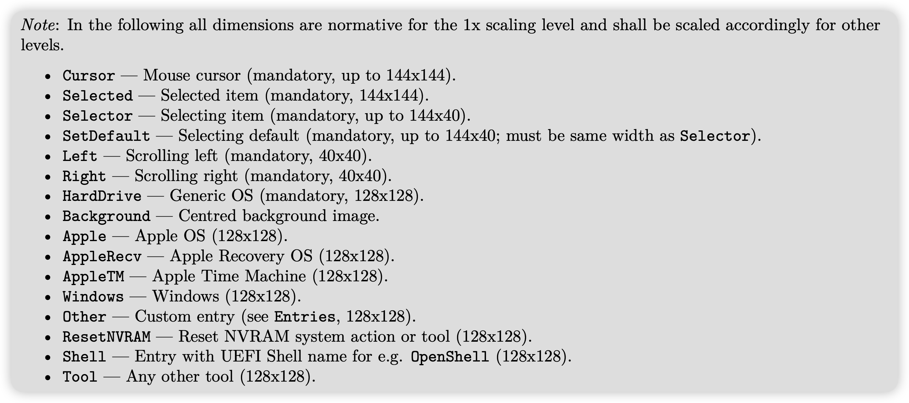
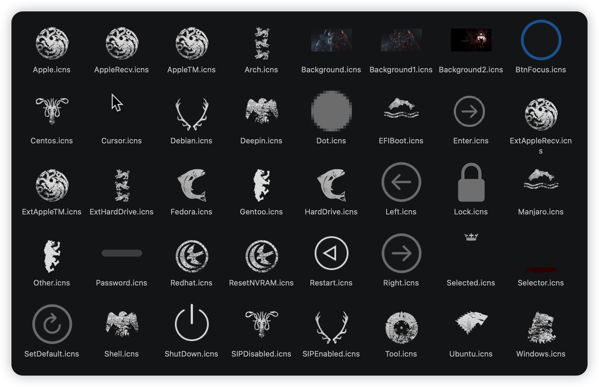
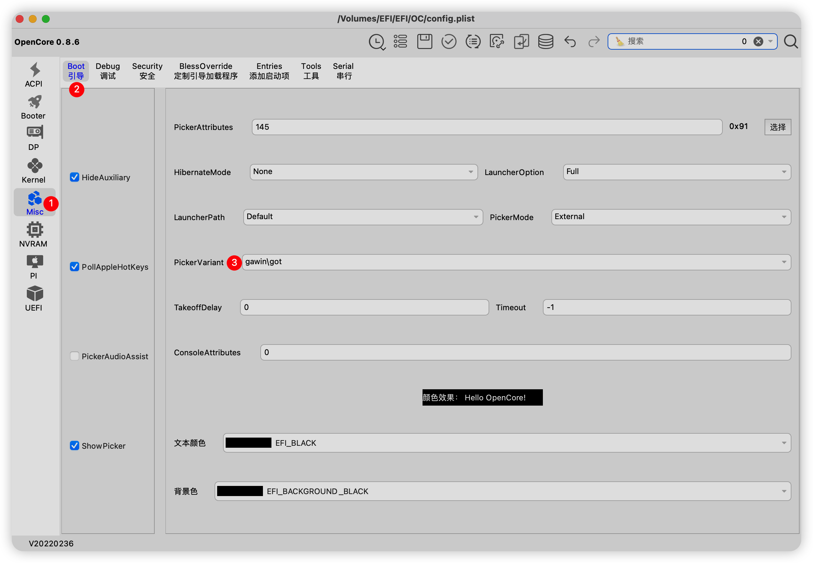

# 定制Opencore主题

### 1. 工具准备
- 首先参考`B站up主@乌龙蜜桃来一打`的[视频][1]
- png图片转icns的工具[OpenCanopy-Generator][2]
- 根据opencore的[指南手册][3]，准备必要的一些文件，命名需要按照下图这些

例如下面是我的主题使用的命名

### 2. 编辑图片
- 需要准备的是符合手册分辨率要求的png图片，如果在Nvram中设置了`UIscale=2`，就需要是上述分辨率的两倍，例如`128x128`的要变成`256x256`，分辨率不对会导致引导界面看不到图片。壁纸同样从`1920x1080`改为`3840x2160`，同时注意，壁纸分辨率最高就是`3840x2160`
- 编辑图片可以使用在线的[photopea][4]，如果有本地的当然更好，photopea使用方法跟photoshop几乎一样，可以更改图像大小，jpg转png
- 将准备的png图片都放到一个文件夹里，打开OpenCanopy-Generator，并把所有图片都拖进它的窗口里，按照指示一步步继续，知道生成转换好的压缩包

### 3. 编辑EFI
在`Resources/Image`目录下创建主题文件夹A，同时在A文件夹里再创建一级文件夹B，在B里存放所有文件，最后修改config.plist

### 4. 定制引导顺序
- 具体可以参考`B站up主@乌龙蜜桃来一打`的[视频][5]
- Flavour的盘符命名类似`Windows10:Windows`，`Ubuntu:Linux`，`Monterey:Apple`，在找不到冒号前的命名时，就会使用冒号后的名字去搜索图标

[1]: https://www.bilibili.com/video/BV1ET4y1y7oj/?spm_id_from=333.337.search-card.all.click&vd_source=6490fdeace441498fe2b3c402da6f958
[2]: https://github.com/chris1111/OpenCanopy-Generator
[3]: https://github.com/acidanthera/OpenCorePkg/blob/master/Docs/Configuration.pdf
[4]: https://www.photopea.com/
[5]: https://www.bilibili.com/video/BV1gY411h7hH/?spm_id_from=333.999.0.0&vd_source=6490fdeace441498fe2b3c402da6f958