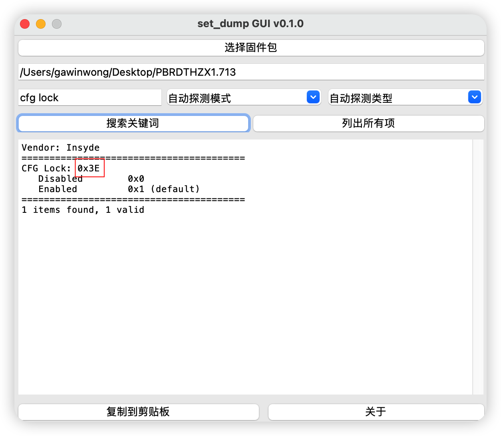
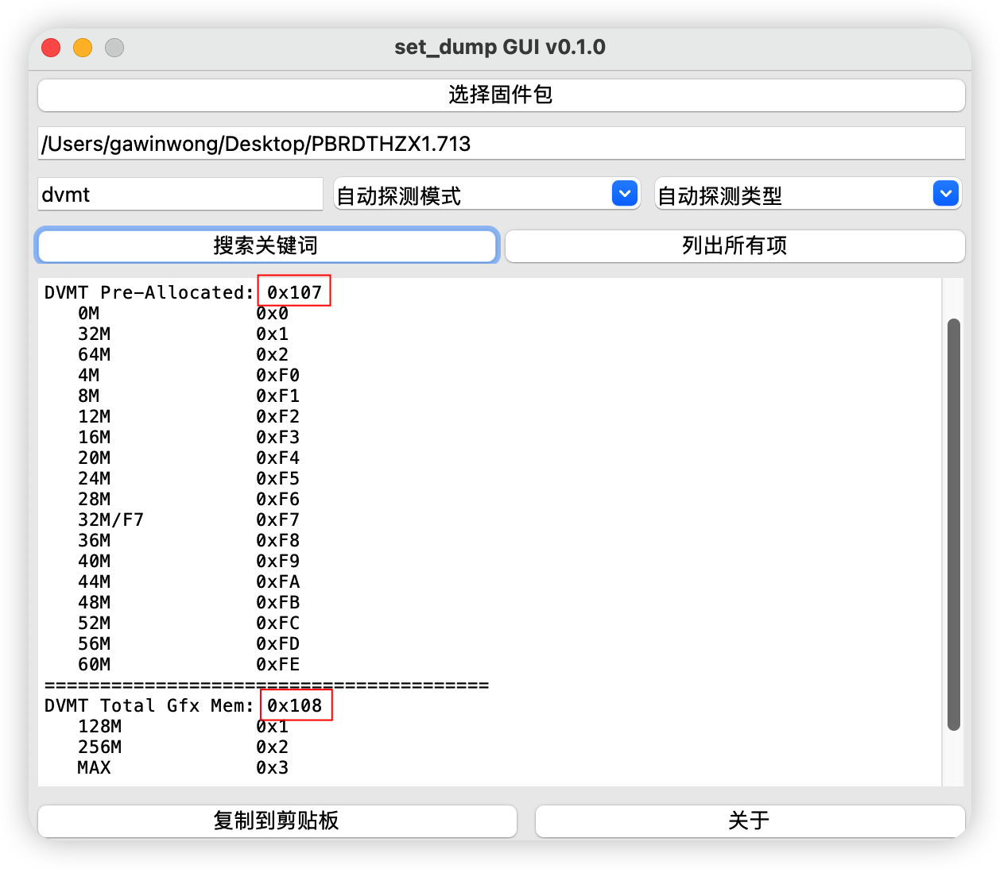

# 解锁CFG LOCK及更改DVMT

### 0. Opencore指南
可以先参考opencore指南，把[解锁CFG LOCK][5]的过程看一遍

### 1. 主要参考
首先感谢`B站up主@乌龙蜜桃来一打`，[他的视频][1]提供了诸多解决思路。我们这里使用的是modGRUBShell.efi而不是RU.efi

### 2. 准备bios文件
神舟的bios有专门的网站维护，可以去[这里][2]下载<br>
下载后解压，文件比较大且后缀名比较奇怪的就是我们需要的bios文件

### 3. 下载工具包
使用远景论坛`用户@emyself`提供的工具[set_dump][3]，用于从bios中找到我们需要的地址<br>
也可以使用上面up主整理的[工具合集][4]<br>
下载[modGRUBShell.efi][7]

### 4. 找出需要的地址
运行`set_dump`，打开准备好的bios文件，搜索栏输入`cfg lock`，点击`搜索关键词`，等待出现结果。记录下地址即图中红框的数值，列表则是这个选项可以设置的参数，记下`Disabled`对应的数值

用同样的方法找到DVMT的地址，记下`64M`和`MAX`对应的数值


### 5. 正式解锁
- 一般情况下，CFG LOCK的VarStore位于0x03，即CpuSetup，DVMT位于0x02，即SaSetup。
不过最好还是自己确认下，参考指南，[使用UEFITool和IFR-Extractor][6]，获取bios的详情数据

- 重启进入OC引导界面，点击`modGRUBShell.efi`，根据上面得到的地址输入以下命令，跟在0x3E后面的0x01代表修改一个字节
```
setup_var_cv CpuSetup 0x3E 0x01 0x00
setup_var_cv SaSetup 0x107 0x01 0x02
setup_var_cv SaSetup 0x108 0x01 0x03
```

- 按下`Ctrl+Alt+Delete`重启进入OC引导界面，点击`VerifyMsrE2.efi`<br>
如果是`This firmware has UNLOCKED MSR OXE2 register!`说明解锁成功<br>
如果是`This firmware has LOCKED MSR OXE2 register!`则是没有解锁


[1]: https://www.bilibili.com/video/BV1LV4y1N7jF/?spm_id_from=333.337.search-card.all.click&vd_source=6490fdeace441498fe2b3c402da6f958
[2]: http://kfgl.hasee.com/lookup/bios/bios_nb.asp
[3]: https://bbs.pcbeta.com/viewthread-1838436-1-1.html
[4]: https://pan.baidu.com/s/1UbSJh6jd14Dfeic8CCIpHg?pwd=fols
[5]: https://dortania.github.io/OpenCore-Post-Install/misc/msr-lock.html#fixing-cfg-lock
[6]: https://dortania.github.io/OpenCore-Post-Install/misc/msr-lock.html#turning-off-cfg-lock-manually
[7]: https://github.com/datasone/grub-mod-setup_var/releases