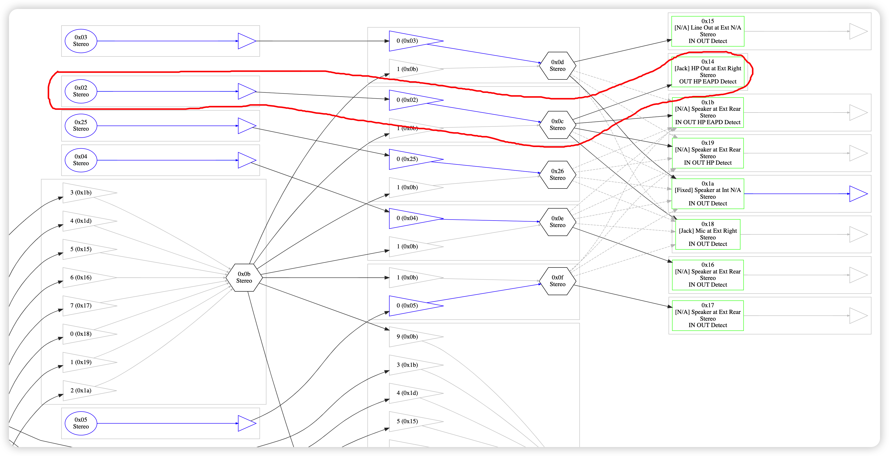

# 驱动声卡

### 1. 查询声卡型号
- 在windows里使用设备管理器，点击声卡，查看属性，详细信息里找硬件_ID
- 在linux里，通过查看`/proc/asound/card\*/codec\*`来查看声卡的型号，例如我的电脑`/proc/asound/card0/codec0`第一行为`Codec: Realtek ALC1220`

### 2. 使用已有的layout-id
根据[opencore指南][1]，根据自己声卡的型号，可以先使用相同型号的layout-id，看是否可以驱动声卡<br>
目前不同声卡型号的支持layout-id有[这些][2]<br>

### 3. 定制AppleALC驱动
如果上面的layoutid都不行，就需要定制AppleALC了<br>
需要根据自己声卡的接口和pathmap生成AppleALC.kext和layoutid<br>
主要参考Github上`@ycg31`这篇[教程][3]，辅助参考黑果小兵的[这篇文章][4]，以下补充定制过程中遇到的一些问题及处理方法
- **Linux**：
    - 首先我们最好得有一个linux环境，这样方便提取声卡的codec数据
    - 在linux里，执行下面的命令，获取当前声卡可用的接口
        ```
        dmesg | grep snd_hda_codec_realtek
        ```
    - 例如我的声卡有5个接口，但是这里还看不出他们的详细信息
    
    - 在linux查看/proc/asound/card*/codec*文件，我这里有两个card，card0有两个codec，分别是codec0和codec1，通过查看codec0的首行，发现card0的codec0就是我们找的ALC1220，而card1是独显的HDMI声卡<br>
    将/proc/asound/card0/codec0导出到U盘或是其他能被macOS读取到的目录

    - 如果在macOS里按照`@ycg31`教程生成ConfigData和verbs.txt文件后，继续用codecgraph生成pathmap图会报错，这是因为macOS 12.3之后的版本都移除了python2，因此需要在linux里生成pathmap(*.svg文件)，将得到的pathmap导出到U盘或是其他能被macOS读取到的目录
- **macOS**：
    - 按照`@ycg31`教程生成ConfigData和verbs.txt文件，并记录verbs.txt里的DevID
    - 将pathmap(*.svg文件)使用浏览器打开
    
    - 查找路径的方法：红圈节点为声音输入，蓝圈节点为声音输出，蓝色三角加线为有效信号流，这样就只有4条有效路径
    
    
    
    
    - 以我的声卡为例，整理出pathmap的路径如下

    |有效节点|10进制|设备描述|路径|
    |:---|:---|:---|:---|
    |0x12|18|内置麦克风输入|8->35->18|
    |0x1e|30|SPDIF输出|30->6|
    |0x14|20|耳机输出|20->12->2|
    |0x1a|26|内置扬声器输出|26->13->3|
    - 和linux使用dmesg得到的接口相比，少了一个0x18节点，这个应该是耳麦，有输入和输出。但是不考虑加入这个节点的路径，否则插入耳机再拔出就会切换到耳麦节点，扬声器就没法发声了
    - 使用xcode编辑xml文件没法像plist文件那样变成直观的列表，可以把xml文件的后缀名改成plist再使用xcode打开，比如打开我新加入的Platforms52.xml文件，改成Platforms52.plist再打开，修改完千万记得改回xml的后缀
    
    - 红框item1下的蓝框item0和item1代表同一组，就是一个工作另一个就自动停止输入或输出，把内置扬声器放在前面，这样开机后默认工作的就是内置扬声器
    - 使用xcode打包出AppleALC.kext时要注意检查当前的项目是哪个，否则就看不到kext了
    

### 4. 将驱动导入EFI
- 我定制的Hasee Z7-CT7Pro AppleALC在[这里][5]
- 使用[gfxutil][5]查看声卡的PCI位置
```
./gfxutil | grep HDEF
```
- 在config.plist里添加layoutid，注意layoutid要从10进制转为16进制并大小端对调

- 将定制的AppleALC.kext替换OC/Kexts里的AppleALC.kext

### 5. 检查是否驱动声卡
- 重启进入系统，随便播放音乐，看扬声器是否能发声，插入耳机再听，拔出耳机后再听
- 打开siri，跟他聊天，看麦克风是否工作


[1]: https://dortania.github.io/OpenCore-Post-Install/universal/audio.html#fixing-audio-with-applealc
[2]: https://github.com/acidanthera/AppleALC/wiki/Supported-codecs
[3]: https://github.com/ycg31/Hackintosh/blob/monterey/%E7%94%A8AppleALC%E5%AE%9A%E5%88%B6%E5%A3%B0%E5%8D%A1%E8%AE%B0%E5%BD%95.md
[4]: https://blog.daliansky.net/Use-AppleALC-sound-card-to-drive-the-correct-posture-of-AppleHDA.html
[5]: https://github.com/gawinwong/AppleALC
[6]: https://github.com/acidanthera/gfxutil/releases
