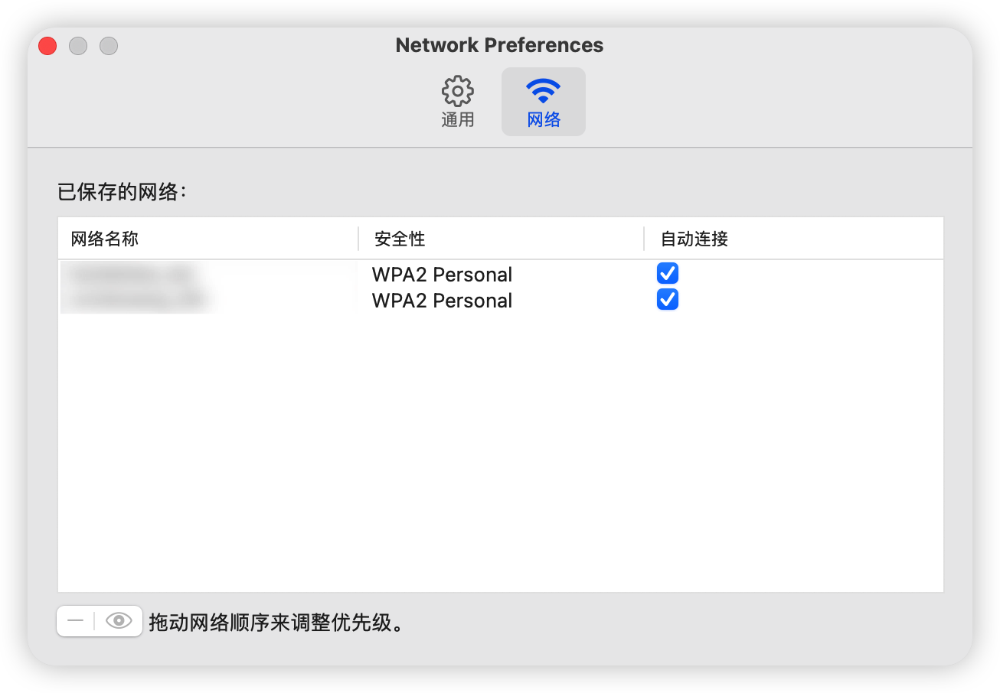

# 驱动无线网卡

### 1. 安装itlwm
下载[itlwm][1]，解压后将kext放到OC/Kexts里，并在config.plist中添加itlwm.kext这条记录

### 2. 安装客户端
下载[HeliPort][2]，解压后将HeliPort.app拖到`Finder/应用程序`里 
在`设置-用户与群组-登陆项`里添加HeliPort，勾选`隐藏` 
在HeliPort的偏好设置里，可以控制wifi是否自动连接，连接的顺序

### 3. 使用Airport版无线驱动
按照这个[指导][3]，但是`AirportItlwm`的稳定性不如`itlwm`

[1]: https://github.com/OpenIntelWireless/itlwm/releases
[2]: https://github.com/OpenIntelWireless/HeliPort/releases
[3]: https://openintelwireless.github.io/itlwm/Installation.html#airportitlwm