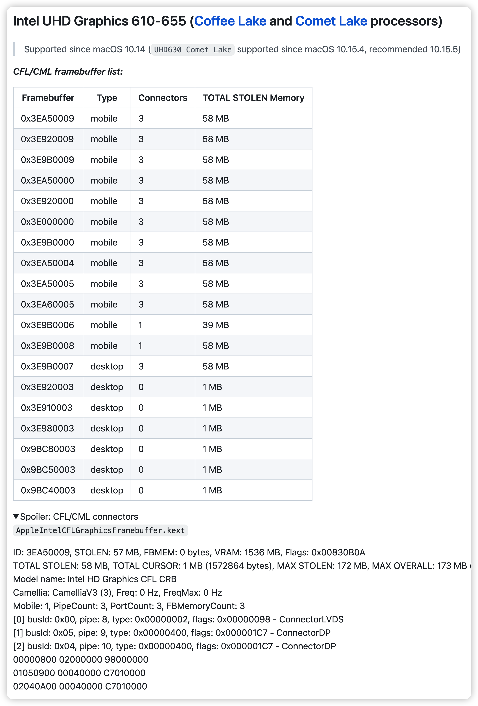
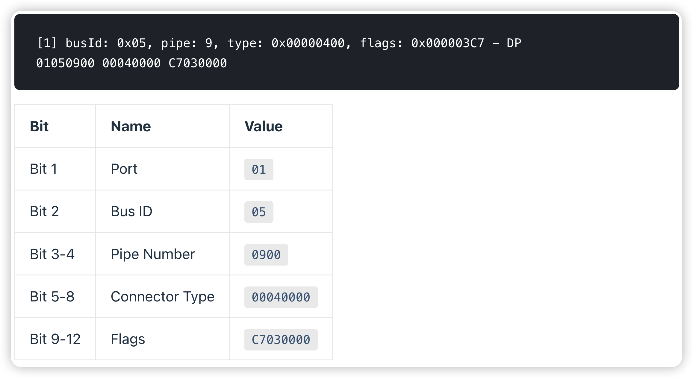
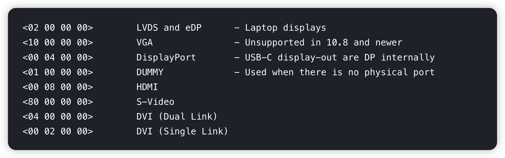
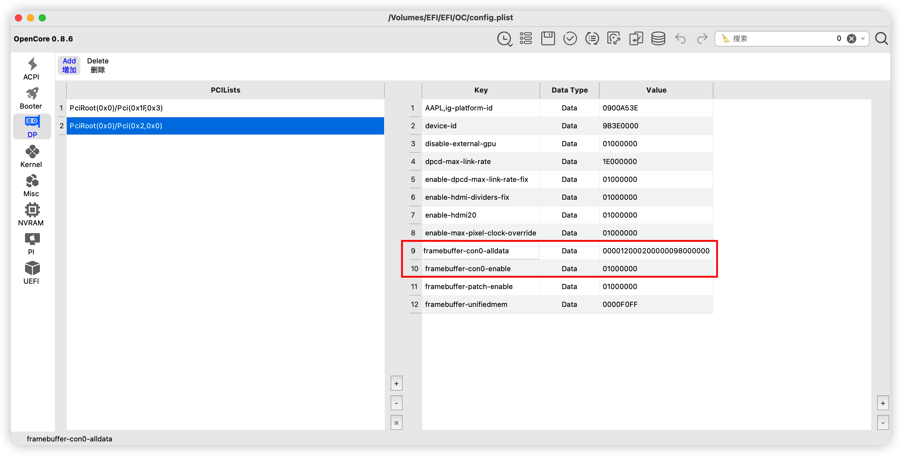

# 驱动核显

### 0. 前置参考[Opencore指南][1]
opencore的指南比较详细了，但是对于很多参数的说明还是空白，需要再结合[WhateverGreen的文档][2]对config.plist做调整

### 1. 基本说明
一般来说，屏幕不太特殊的1080P LCD屏幕都可以只使用`AAPL,ig-platform-id`驱动，对于4k屏幕或者一些特殊的cpu则需要打缓冲帧

### 2. 确认输出接口位置
- 如果HDMI、DP是直连独显的，就没办法使用核显连接副屏
- 可以在windows里，用线连接副屏，再在设备管理器里将独显禁用，看有没有画面来判断是否直连独显

### 3. 打缓冲帧补丁
启用缓冲帧补丁，必须加`framebuffer-patch-enable`

根据[WhateverGreen的文档][2]找到CPU对应的核显型号，例如[UHD630][3] 
再根据`Recommended framebuffers`使用最合适的platformid 
填入`AAPL,ig-platform-id`时，要注意使用大小端对调后的ID，即3EA50009->0900A53E

展开Spoiler得到的就是platformid对应的缓冲帧信息，以0x3EA50009为例，最下面三行是这个ID对应的三个Entry

Entry的说明如下

连接类型如下

因为我的笔记本HDMI和DP都不能用核显输出，所以只需要对内屏的端口打补丁，也就是con0，由于担心误插拔HDMI、DP导致重启，我将管道(pipe)设为12。多余的两个entry则不需要，由此得到红框部分

如果需要定制Entry来使用HDMI、DP输出，要调整BusID，这部分可以参考`B站up主@乌龙蜜桃来一打`的[视频][4]

### 4. 4K屏需要的参数
由于4K屏的特殊性，需要加一些额外的参数
|参数|数值|说明|
|:---|:---|:---|
|disable-external-gpu|01000000|配合ACPI的[SSDT-DGPU.aml][5]一起使用屏蔽独显|
|enable-dpcd-max-link-rate-fix|01000000|[打开最大链接速率修复][6]|
|dpcd-max-link-rate|1E000000|指定链接速率0x0A(HBR)、0x14(HBR2)、0x1E(HBR3)|
|enable-hdmi-dividers-fix|01000000|修复HDMI无限循环，对4K屏，不加这个参数会黑屏|
|enable-hdmi20|01000000|为高分辨率屏幕启用60Hz支持，对4K屏，不加这个参数会黑屏|
|enable-max-pixel-clock-override|01000000|针对高分辨率屏幕提高最大像素时钟限制，不加会导致boot卡住|
|framebuffer-unifiedmem|00000060(1536M，默认) 00000080(2048M，如果花屏/闪屏可尝试) 000000C0(3072M，不推荐) 0000F0FF(4095M，最大值)|设置核显使用的显存大小，实际不会起作用，whatevergreen也不推荐使用，但是能改变`关于本机`看到的图形卡显存大小|

### 5. 检查是否驱动核显
`关于本机`看到的图形卡显存大小为1536M以上且运行不会卡顿 
如果是7M或是31M，则是没驱动成功，考虑换platformid，不行就换机型，再不行就检查BIOS、CFG LOCK和DVMT是否正确设置了

[1]: https://dortania.github.io/OpenCore-Post-Install/gpu-patching/intel-patching/#intel-igpu-patching
[2]: https://github.com/acidanthera/WhateverGreen/blob/master/Manual/FAQ.IntelHD.en.md
[3]: https://github.com/acidanthera/WhateverGreen/blob/master/Manual/FAQ.IntelHD.en.md#intel-uhd-graphics-610-655-coffee-lake-and-comet-lake-processors
[4]: https://www.bilibili.com/video/BV1WS4y187u9/?spm_id_from=333.788.recommend_more_video.1&vd_source=6490fdeace441498fe2b3c402da6f958
[5]: https://dortania.github.io/Getting-Started-With-ACPI/Desktops/desktop-disable.html#disabling-desktops-unsupported-gpus-ssdt-gpu-disable
[6]: https://github.com/acidanthera/WhateverGreen/blob/master/Manual/FAQ.IntelHD.en.md#fix-the-invalid-maximum-link-rate-issue-on-some-laptops-dell-xps-15-9570-etc